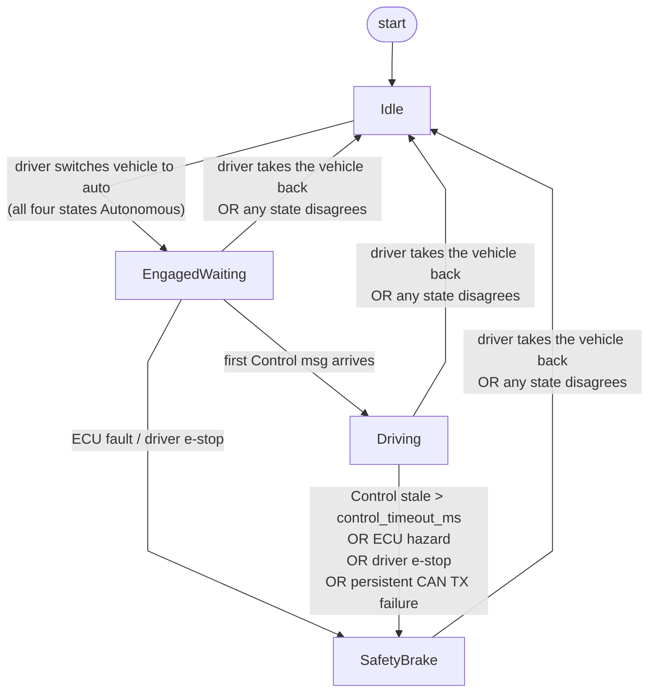

# golfcart_vehicle_interface

ROS 2 vehicle interface for the Turing Drive CAN protocol (`CAX_ADS_CAN.dbc`).
Bridges Autoware control / status topics to the four `ADS_VCU_*` command
frames and decodes the four `VCU_ADS_*` report frames into Autoware vehicle
state messages.

Implementation is Rust (`rclrs`), built with `colcon-cargo-ros2`.

## Architecture

```
                ┌─── ROS executor (main thread) ───┐
                │  subs → SharedState.command       │
                │  pubs ← SharedState.status        │
                └────────────┬─────────────────────┘
                             │ Arc<SharedState> (Mutex<…>)
                ┌────────────┴─────────────────────┐
                │                                  │
        ┌───────▼────────┐                ┌────────▼───────┐
        │ can_rx thread  │                │ can_tx thread  │
        │ blocking read  │                │ fixed-rate     │
        │ → status       │                │ encode → write │
        └────────────────┘                └────────────────┘
```

Two native threads on top of the ROS executor; coordination via
`Arc<SharedState>` containing two `parking_lot::Mutex` (one per direction,
lock-ordering `command` → `status`).

## Control mode — the driver's, not ours

Every mode transition is made by the driver on the vehicle's own controls.
This node never requests one; it reads back the four subsystem states the VCU
reports and aggregates them:

| `MTR` (`Motor_State`) | `BRK` (`Brake_State`) | `EPS` (`EPS_State`) | `Drv` (`Driving_State`) | aggregate `VehicleMode` |
|---|---|---|---|---|
| Manual | Manual | Manual | Manual | `Manual` |
| Autonomous | Autonomous | Autonomous | Autonomous | `Autonomous` |
| anything else — mixed, `Invalid`, `Remote Control`, or a stale/missing frame | | | | `Abnormal` |

**Commands go on the wire only in `Autonomous`.** In `Manual` and `Abnormal`
the four `ADS_VCU_*` frames are still transmitted, but as pure heartbeat: all
enables `0`, all setpoints `0`, all mode fields `0`, no `Veh_Auto_En`, no
`Veh_Estop`, no light commands. That heartbeat is what lifts `MTR` and `EPS`
out of `Invalid` on the VCU side after a restart without commanding anything.

The one field that is *not* zero is `Ads_Vcu_Ads_Status`, held at `Running` for
as long as the node transmits. It reports this node's own health, not whether we
are driving: the VCU reads it as "is the ADS alive and sane" and will not leave
`Manual` while it says `Error`. The driver presses the AUTO button while we are
idle, so an idle frame that says `Error` makes the button do nothing. The idle
heartbeat is byte-identical to the ROOTS bench simulator's, which is the frame
set the VCU is known to accept:

| Frame | Idle payload |
|---|---|
| `RX_ADS_VCU_MTR` (`0x075`) | `00 00 00 00 00 00 00 00` |
| `RX_ADS_VCU_BRK` (`0x068`) | `00 00 00 00 00 00 00 00` |
| `RX_ADS_VCU_EPS` (`0x065`) | `00 00 00 00 00 00 00 00` |
| `RX_ADS_VCU_VEHICLE` (`0x43F`) | `02 00 00 00 00 00 <rolling> 00` |

`can_io::heartbeat_tests` asserts exactly these bytes.

A frame older than `report_timeout_ms` counts as missing — a cached state from
a VCU that has gone quiet says nothing about who holds the vehicle now.

`Abnormal` is also the state a partial handover passes through, and the one a
VCU restart lands in (`BRK` and `Drv` come up `Invalid` until a brake-pedal
press; see `docs/roadmaps/2-vehicle-interface-testing.md`).

## TX FSM

The TX thread evaluates a four-state machine every tick to decide what to
put on the wire.



### Per-mode TX payload

| Mode | motor_en | gear_en | brake_en | eps_en | veh_auto_en | brake (deceleration) | blinker |
|---|---|---|---|---|---|---|---|
| `Idle` | 0 | 0 | 0 | 0 | 0 | 0 | off |
| `EngagedWaiting` | 0 | 0 | 0 | 0 | 1 | 0 | user |
| `Driving` | 1 † | 1 | 1 | 1 | 1 | `target_decel` | user |
| `SafetyBrake` | 0 | 0 | 1 | 0 | 1 | 3.0 m/s² (+ `Veh_Estop`) | Hazard |

ROOTS actuates braking from `Ads_Vcu_Target_Deceleration` only; stroke and
pressure are ignored, so both are always sent as `0` (see
[ROOTS DBW behaviour](#roots-dbw-behaviour)).

† `motor_en` drops to `0` (with throttle / accel / speed zeroed) whenever a
planner deceleration is active (`target_decel > 0`), matching the VCU's
decel-priority torque cut. `gear_en` stays `1` so the requested gear is always
known.

### Evaluation precedence

Checked in `TxMode::evaluate`, first match wins:

1. `vehicle_mode != Autonomous` → `Idle` (mode gate — nothing else is consulted)
2. `fault_latched || estop` → `SafetyBrake`
3. `was_driving && stale` → `SafetyBrake`
4. `!stale` → `Driving`
5. else → `EngagedWaiting`

`stale` = no Control message for `control_timeout_ms`; `was_driving` = at least
one Control was received since the vehicle last entered `Autonomous` (the
timestamp is cleared on that transition, so a handover never starts in
`SafetyBrake`).

Note the mode gate outranks the e-stop: a driver e-stop or latched fault while
the vehicle is in manual leaves us silent rather than braking behind the
driver's back — their own pedal is the authority there.

## CAN message overview

DBC source: `CAX_ADS_CAN.dbc`. Frame structures generated at build time by
`dbc-codegen`; see `build.rs`.

### TX (ADS → VCU) — written by this node at `tx_rate_hz`

- `ADS_VCU_MTR` — motor / gear setpoint
- `ADS_VCU_BRK` — brake setpoint
- `ADS_VCU_EPS` — steering setpoint
- `ADS_VCU_VEHICLE` — auto-en / e-stop / blinker / headlight / rolling counter

### RX (VCU → ADS) — decoded into status state

- `VCU_ADS_MTR` — motor state, throttle, gear, vehicle speed
- `VCU_ADS_BRK` — brake state, position, stroke, pressure
- `VCU_ADS_EPS` — EPS state, tire angle
- `VCU_ADS_VEHICLE` — driving state, e-stop, blinker, per-subsystem error codes

Frame IDs, signal layouts, and scaling factors are defined by the Turing
Drive CAN protocol (`CAX_ADS_CAN.dbc`). The DBC is proprietary and is not
included in this repository — see [Building from source](#building-from-source)
below.

## ROOTS DBW behaviour

Vendor-specific semantics from the **ROOTS Drive-by-Wire 使用說明** manual that
the TX path is written against. These are ROOTS quirks, not generic DBC
behaviour, and they constrain what command values are actually honoured.

- **Braking is deceleration-only.** ROOTS acts solely on
  `Ads_Vcu_Target_Deceleration` (`ADS_VCU_BRK`, `0x068`). `Target_Stroke` and
  `Target_Pressure` are *not effective* and are always transmitted as `0`.
- **Segmented brake.** Deceleration maps to discrete brake stages, not a linear
  curve:

  | Commanded deceleration | Brake output |
  |---|---|
  | `0.0 – 1.2 m/s²` | no actuation (coast) |
  | `1.2 – 1.8 m/s²` | stage 1 (≈ 33 %) |
  | `1.8 – 2.8 m/s²` | stage 2 (≈ 70 %) |
  | `≥ 2.8 m/s²` | stage 3 (≈ 100 %) |

- **Deceleration has priority over speed.** Once deceleration `> 0`, the VCU
  cuts motor torque to protect the motor. The TX path mirrors this by zeroing
  the motor frame while decelerating.
- **Speed setpoint is `[0, 25] km/h`, magnitude only.** Direction is selected by
  the gear, not the sign of `Ads_Vcu_Target_Speed`. Setpoints are clamped to a
  non-negative magnitude (`ROOTS_MAX_SPEED_MPS = 6.944 m/s ≈ 25 km/h`).
- **No Park gear.** A `Parking` command makes ROOTS apply maximum deceleration
  to hold the vehicle; the speed command is then ignored. Use a safety brake /
  e-stop to stop while moving — the gear-change gate only forwards `Parking` at
  low speed.
- **Tire angle range is `[-30, 30]°`** (`Ads_Vcu_Target_Tire_Angle`,
  `ADS_VCU_EPS`, `0x065`). The default `max_tire_angle_rad` (≈ 20°) stays well
  inside this.
- **30 Hz rolling-counter gate.** The VCU monitors `Ads_Vcu_Rolling_Counter` in
  `ADS_VCU_VEHICLE` (`0x43F`) and refuses autonomous mode if the rate falls far
  below ~30 Hz. `tx_rate_hz` defaults to 100 Hz. (The manual's reference to
  "msg ID 0x48" is the rolling-counter bit offset, 48, within `0x43F`.)
- **CAN bus**: `can0`, 500 kbit/s, sample point 87.5 %, **standard** IDs (not
  CAN FD). Bring the link up with `scripts/setup-physical-can.sh` (see the NAS
  VCU-manual folder for the vendor copy).

## Known limitations

Tracked gaps against the vendor manual. See `CHANGELOG.md` for what has already
been aligned.

- **Checksum is stubbed.** `Veh_Chksum` (and the other `*_Chksum` fields)
  algorithm is not provided by Turing Drive — every TX frame currently transmits
  `0` (`checksum_stub()` in `src/dbc.rs`). If the VCU validates the checksum,
  frames will be rejected and the vehicle will not move. **Blocker for
  real-vehicle bring-up; confirm with the vendor whether the field is enforced.**
- **Segmented-brake dead-zone not remapped.** Deceleration requests below
  `1.2 m/s²` produce no braking on ROOTS, so gentle planner stops coast. The
  interface passes the value through unchanged; biasing low requests into the
  active band (or documenting the coast as intentional) is an open tuning
  decision.
- **`can0` setup script** does not set the 87.5 % sample point explicitly
  (`scripts/setup-physical-can.sh`). Acceptable on most controllers that default
  to a compatible sample point, but worth pinning to match the vendor spec.

## Domain enums (mapped from DBC `VAL_` tables)

- `Gear` — Parking / Drive / Neutral / Reverse
- `MotorMode` — Pedal / Speed
- `BrakeMode` — Invalid / Stroke / Pressure
- `EpsMode` — Invalid / FrontWheel / OppositePhase / InPhase
- `BlinkerCtrl` — Off / Left / Right / Hazard
- `SubsystemState` — Invalid / Manual / Autonomous / RemoteControl

## ROS interface

All input/output topics use private namespace (`~/`); `vehicle_interface.launch.xml`
remaps to Autoware-standard names.

### Subscribers

| Topic (after remap) | Type | Purpose |
|---|---|---|
| `/control/command/control_cmd` | `autoware_control_msgs/Control` | Speed / accel / steering setpoint. Triggers `last_control_at` watchdog refresh. |
| `/control/command/gear_cmd` | `autoware_vehicle_msgs/GearCommand` | Park / Drive / Neutral / Reverse. Subject to anti-chatter latch. |
| `/control/command/turn_indicators_cmd` | `autoware_vehicle_msgs/TurnIndicatorsCommand` | Left / Right / Off. Hazard subscription overrides. |
| `/control/command/hazard_lights_cmd` | `autoware_vehicle_msgs/HazardLightsCommand` | Hazard On / Off. |
| `/control/command/emergency_cmd` | `tier4_vehicle_msgs/VehicleEmergencyStamped` | Autoware MRM operator e-stop. |
| `/vehicle/emergency_stop` | `std_msgs/Bool` | Manual button / hand-rolled e-stop. |

### Publishers

| Topic (after remap) | Type | Notes |
|---|---|---|
| `/vehicle/status/velocity_status` | `autoware_vehicle_msgs/VelocityReport` | From `VCU_ADS_MTR.Vehicle_Speed`. |
| `/vehicle/status/steering_status` | `autoware_vehicle_msgs/SteeringReport` | From `VCU_ADS_EPS.Tire_Angle`. |
| `/vehicle/status/gear_status` | `autoware_vehicle_msgs/GearReport` | From `VCU_ADS_MTR.Gear_Position`. |
| `/vehicle/status/control_mode` | `autoware_vehicle_msgs/ControlModeReport` | Aggregate of the four VCU subsystem states: all-auto → `AUTONOMOUS`, all-manual → `MANUAL`, otherwise `NOT_READY`. A latched fault overrides to `DISENGAGED`. |
| `/vehicle/status/turn_indicators_status` | `autoware_vehicle_msgs/TurnIndicatorsReport` | From `VCU_ADS_VEHICLE.Blinker`. |
| `/vehicle/status/hazard_lights_status` | `autoware_vehicle_msgs/HazardLightsReport` | From `VCU_ADS_VEHICLE.Blinker`. |
| `/vehicle/status/actuation_status` | `tier4_vehicle_msgs/ActuationStatusStamped` | Throttle / brake / steer feedback. |
| `/diagnostics` | `diagnostic_msgs/DiagnosticArray` | 1 Hz health rollup. Keys: `vehicle_interface`, `vehicle_interface/{system,motor,eps,brake,estop,can_tx,blinker,frame_mtr,frame_eps,frame_brk}`. |

### Service

| Topic (after remap) | Type | Purpose |
|---|---|---|
| `/control/control_mode_request` | `autoware_vehicle_msgs/ControlModeCommand` | `AUTONOMOUS` cannot engage anything — the driver does that on the vehicle — so it is an acknowledgement only: `success=true` iff the VCU already reports all four subsystems autonomous and no fault is latched. `MANUAL` / `NO_COMMAND` clears `fault_latched` and zeroes held setpoints. `AUTONOMOUS_STEER_ONLY` / `AUTONOMOUS_VELOCITY_ONLY` rejected (not implemented). |

### QoS

Command subs use `KeepLast(1) Reliable` to match Autoware `vehicle_cmd_gate`
publisher conventions. Mismatched QoS would silently drop all messages.

## Parameters

| Name | Type | Default | Description |
|---|---|---|---|
| `can_interface` | string | (mandatory) | SocketCAN interface name (e.g. `can0`). |
| `tx_rate_hz` | f64 | 100.0 | Frequency of `ADS_VCU_*` heartbeat. |
| `publish_rate_hz` | f64 | 50.0 | Frequency of Autoware status reports. |
| `frame_id` | string | `base_link` | `frame_id` written into VelocityReport.header. |
| `control_timeout_ms` | i64 | 500 | Max age of a Control msg before TX trips into `SafetyBrake`. |
| `control_min_rate_hz` | f32 | 10.0 | Minimum Control publish rate to command a speed. Below it the speed setpoint is held at 0, with a throttled warning and a `vehicle_interface/control_rate` WARN diagnostic. Steering, gear and brake still pass. 0 disables. |
| `report_timeout_ms` | i64 | 1000 | Max age of a VCU_ADS_VEHICLE frame before status counts as stale. |
| `max_speed_mps` | f64 | 5.0 | Cap on speed setpoint magnitude. Effective cap is `min(max_speed_mps, 6.944)` — ROOTS tops out at 25 km/h. Direction is set by the gear; the setpoint is always non-negative. |
| `max_accel_mps2` | f64 | 2.0 | Cap on forward accel setpoint. |
| `max_decel_mps2` | f64 | 4.0 | Cap on brake decel setpoint. |
| `max_tire_angle_rad` | f64 | 0.349 | Cap on tire-angle setpoint magnitude (≈20°). |
| `invert_steering` | bool | `true` | Flip the tire-angle sign at the CAN boundary. Autoware counts positive to the left (REP-103), ROOTS to the right. Applied to TX setpoints and to the decoded `SteeringReport` / actuation status. |
| `steer_rate_stopped_rps` | f64 | 0.4 | Slew rate while \|v\| < 0.05 m/s **or** MTR stale. |
| `steer_rate_low_vel_rps` | f64 | 0.4 | Slew rate while v < `steer_low_vel_thresh_mps`. |
| `steer_rate_nominal_rps` | f64 | 0.8 | Slew rate at nominal speed. |
| `steer_low_vel_thresh_mps` | f64 | 1.0 | Speed boundary between low and nominal slew. |
| `gear_change_margin_ms` | i64 | 2000 | Min dwell between accepted gear changes (anti-chatter). |
| `shift_brake_decel_mps2` | f64 | 3.0 | Brake deceleration asserted while a shift is pending at low speed (ROOTS honours deceleration, not pressure; default sits in brake stage 3). |
| `shift_low_vel_thresh_mps` | f64 | 0.1 | \|v\| below which gear shifts are allowed and brake-during-shift asserted. |

## Failure modes handled

- Control watchdog: stale Autoware control → `SafetyBrake` after
  `control_timeout_ms`.
- VCU report freshness: stale `VCU_ADS_VEHICLE` → `ControlModeReport::NOT_READY`,
  diag STALE; per-frame `frame_{mtr,eps,brk}` STALE entries.
- ECU hazard latch: any of `Estop` / `Error_Code_*` bits → `fault_latched=true`,
  cleared only by explicit `MANUAL` / `NO_COMMAND` request.
- Driver override: any subsystem the driver switches back to `Manual` breaks
  the all-four-`Autonomous` unanimity, so the mode gate stops commanding on the
  next tick — no separate detection path, and it cannot be missed by watching
  only one signal.
- Parking pin: while the transmitted gear is `P`, target speed and tire angle
  are forced to `0` and `motor_en` / `eps_en` are dropped, re-applied on every
  frame built (mirrors the ROOTS bench simulator's rule).
- Non-negative speed: `Ads_Vcu_Target_Speed` is a magnitude — reverse is gear
  `R` — so it is clamped at `0` both on the subscriber side and again per
  frame; `NaN` folds to `0`.
- Persistent CAN TX failure: `≥ 25` consecutive failed ticks → set
  `fault_latched`, surface `vehicle_interface/can_tx` ERROR diag, attempt
  socket reopen every 50 ticks.
- CAN socket bounce: RX/TX threads reopen socket on persistent error
  (cable yank, USB-CAN reset).
- Setpoint sanitization: clamp on subscriber side to the user-policy caps and
  the DBC signal range so encode never panics. Speed is clamped to a
  non-negative magnitude capped at the ROOTS 25 km/h ceiling.
- Steering slew limit: per-tick rate cap with stopped / low-vel / nominal
  buckets; falls back to stopped rate when MTR is stale.
- Gear anti-chatter: `gear_change_margin_ms` dwell; deceleration brake
  (`shift_brake_decel_mps2`) asserted during pending shift at low speed.
- Driver e-stop: `cmd.estop` latched on either Bool or
  `VehicleEmergencyStamped` topic. Recovery requires a fresh `false`
  publish (stuck-on > stuck-off as fail-safe).

## Building from source

The Turing Drive CAN database (`CAX_ADS_CAN.dbc`) is **not** included in
this repository — it is proprietary to the vendor. Codegen in `build.rs`
needs it at build time.

1. **Obtain `CAX_ADS_CAN.dbc` from Turing Drive.**
2. Place the file via either path:
   - **In-tree (default)**: drop it at
     `src/vehicle/golfcart_vehicle_launch/golfcart_vehicle_interface/CAX_ADS_CAN.dbc`.
     The path is gitignored, so your local copy stays out of commits.
   - **Out-of-tree**: keep it anywhere and point at it:
     ```
     export CAX_ADS_DBC=/path/to/CAX_ADS_CAN.dbc
     ```
3. Build:
   ```
   just build
   ```

`build.rs` reads the DBC and emits two per-build artifacts into `OUT_DIR`:
* `dbc_messages.rs` — typed `dbc-codegen` bindings
* `dbc_limits.rs`   — physical-range bounds used to clamp setpoints

Both are regenerated on every change to the DBC file or `build.rs`.

If the file is missing, the build fails with a clear error pointing back
to this section.

## Running standalone

```
just vehicle interface             # CAN RX only on can0, cart cannot move
just vehicle interface can=vcan0   # bench, against mock_vcu
just vehicle interface tx=on       # TX live - this can drive the cart
just vehicle manual-control                # keyboard teleop, in a second terminal
```

`tx=off` (the default) runs the full node but skips the socket write, so
`/vehicle/status/*` and `/diagnostics` populate without commanding anything.
`just vehicle manual-control` runs `autoware_manual_control` directly: it reads a raw
tty, so it needs a terminal of its own and cannot be a node in a launch file.

## Testing

```
cd src/vehicle/golfcart_vehicle_launch/golfcart_vehicle_interface
cargo test
```

Covers DBC encode/decode round-trips and the `TxMode::evaluate` table
(8 transitions including the cold-start regression).

## Source layout

```
src/
├── main.rs        # entry: spawn CAN threads + ROS executor
├── params.rs      # declare_parameter wiring
├── state.rs       # SharedState (CommandState, StatusState) behind Mutex
├── dbc.rs         # domain enums + include!(generated DBC bindings)
├── can_io.rs      # RX/TX threads, TxMode FSM, socket reopen, FreqWindow
└── node.rs        # subs/pubs/service, timers, message conversion, diagnostics
```

## See also

- `docs/roadmaps/2-vehicle-interface-hardening.md` — initial hardening pass
  vs Autoware `pacmod_interface` reference.
- `docs/roadmaps/2-vehicle-interface-fault-handling.md` — fault handling
  follow-up (TX freshness, socket reopen, frame freshness diag).
