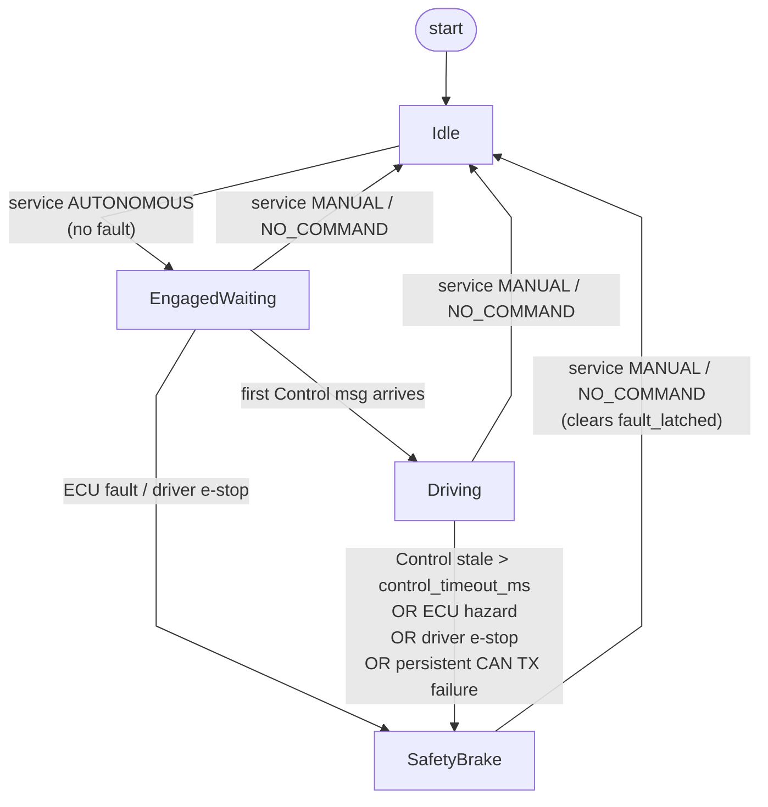

# golfcart_vehicle_interface

ROS 2 vehicle interface for the Turing Drive CAN protocol (`CAX_ADS_CAN.dbc`).
Bridges Autoware control / status topics to the four `ADS_VCU_*` command
frames and decodes the four `VCU_ADS_*` report frames into Autoware vehicle
state messages.

Implementation is Rust (`rclrs`), built with `colcon-cargo-ros2`.

## Architecture

```
                ┌─── ROS executor (main thread) ───┐
                │  subs → SharedState.command       │
                │  pubs ← SharedState.status        │
                └────────────┬─────────────────────┘
                             │ Arc<SharedState> (Mutex<…>)
                ┌────────────┴─────────────────────┐
                │                                  │
        ┌───────▼────────┐                ┌────────▼───────┐
        │ can_rx thread  │                │ can_tx thread  │
        │ blocking read  │                │ fixed-rate     │
        │ → status       │                │ encode → write │
        └────────────────┘                └────────────────┘
```

Two native threads on top of the ROS executor; coordination via
`Arc<SharedState>` containing two `parking_lot::Mutex` (one per direction,
lock-ordering `command` → `status`).

## TX FSM

The TX thread evaluates a four-state machine every tick to decide what to
put on the wire.



### Per-mode TX payload

| Mode | motor_en | gear_en | brake_en | eps_en | veh_auto_en | brake_pressure | blinker |
|---|---|---|---|---|---|---|---|
| `Idle` | 0 | 0 | 0 | 0 | 0 | 0 | user |
| `EngagedWaiting` | 0 | 0 | 0 | 0 | 1 | 0 | user |
| `Driving` | 1 | 1 | 1 | 1 | 1 | 0 (via `target_decel`) | user |
| `SafetyBrake` | 0 | 0 | 1 | 0 | 1 | 4.0 MPa | Hazard |

### Evaluation precedence

Checked in `TxMode::evaluate`, first match wins:

1. `fault_latched || estop` → `SafetyBrake`
2. `auto_enabled && was_driving && stale` → `SafetyBrake`
3. `auto_enabled && !stale` → `Driving`
4. `auto_enabled` → `EngagedWaiting`
5. else → `Idle`

`stale` = no Control message for `control_timeout_ms`; `was_driving` = at
least one Control was received since the most recent engage.

## CAN message overview

DBC source: `CAX_ADS_CAN.dbc`. Frame structures generated at build time by
`dbc-codegen`; see `build.rs`.

### TX (ADS → VCU) — written by this node at `tx_rate_hz`

| ID    | Name             | Key signals |
|-------|------------------|-------------|
| 0x065 | `ADS_VCU_EPS`    | `Eps_En`, `Eps_Mode`, `Target_Tire_Angle` (deg, signed), `Target_Tire_Ang_Speed` |
| 0x068 | `ADS_VCU_BRK`    | `Brk_En`, `Brk_Mode`, `Target_Stroke` (mm), `Target_Pressure` (MPa), `Target_Deceleration` (m/s²) |
| 0x075 | `ADS_VCU_MTR`    | `Motor_En`, `Gear_En`, `Mtr_Mode`, `Target_Gear`, `Target_Throttle_Pos` (%), `Target_Acceleration` (m/s²), `Target_Speed` (m/s, signed) |
| 0x43F | `ADS_VCU_VEHICLE`| `Veh_Auto_En`, `Ads_Status`, `Veh_Estop`, `Blinker_Ctrl`, `Headlight_Ctrl`, `TurnLeft/TurnRight/BackUp/Auto_Prompts`, `DoorCtrl`, `Rolling_Counter`, `Veh_Chksum` |

### RX (VCU → ADS) — decoded into status state

| ID    | Name             | Key signals |
|-------|------------------|-------------|
| 0x100 | `VCU_ADS_BRK`    | `Brake_State`, `Brake_Position` (%), `Brake_Stroke` (mm), `Brake_Pressure` (MPa) |
| 0x101 | `VCU_ADS_MTR`    | `Motor_State`, `Throttle_Position` (%), `Gear_Position`, `Vehicle_Speed` (m/s, signed) |
| 0x102 | `VCU_ADS_EPS`    | `EPS_State`, `Tire_Angle` (deg, signed) |
| 0x103 | `VCU_ADS_VEHICLE`| `Driving_State`, `Estop`, `Blinker`, `Error_Code_Sys/Mtr/Eps/Brk` |

### Outstanding

- `Veh_Chksum` algorithm not provided by Turing Drive — currently transmits
  `0` (`checksum_stub()` in `src/dbc.rs`). Replace once spec is available.

## Domain enums (mapped from DBC `VAL_` tables)

- `Gear` — Parking / Drive / Neutral / Reverse
- `MotorMode` — Pedal / Speed
- `BrakeMode` — Invalid / Stroke / Pressure
- `EpsMode` — Invalid / FrontWheel / OppositePhase / InPhase
- `BlinkerCtrl` — Off / Left / Right / Hazard
- `SubsystemState` — Invalid / Manual / Autonomous / RemoteControl

## ROS interface

All input/output topics use private namespace (`~/`); `vehicle_interface.launch.xml`
remaps to Autoware-standard names.

### Subscribers

| Topic (after remap) | Type | Purpose |
|---|---|---|
| `/control/command/control_cmd` | `autoware_control_msgs/Control` | Speed / accel / steering setpoint. Triggers `last_control_at` watchdog refresh. |
| `/control/command/gear_cmd` | `autoware_vehicle_msgs/GearCommand` | Park / Drive / Neutral / Reverse. Subject to anti-chatter latch. |
| `/control/command/turn_indicators_cmd` | `autoware_vehicle_msgs/TurnIndicatorsCommand` | Left / Right / Off. Hazard subscription overrides. |
| `/control/command/hazard_lights_cmd` | `autoware_vehicle_msgs/HazardLightsCommand` | Hazard On / Off. |
| `/control/command/emergency_cmd` | `tier4_vehicle_msgs/VehicleEmergencyStamped` | Autoware MRM operator e-stop. |
| `/vehicle/emergency_stop` | `std_msgs/Bool` | Manual button / hand-rolled e-stop. |

### Publishers

| Topic (after remap) | Type | Notes |
|---|---|---|
| `/vehicle/status/velocity_status` | `autoware_vehicle_msgs/VelocityReport` | From `VCU_ADS_MTR.Vehicle_Speed`. |
| `/vehicle/status/steering_status` | `autoware_vehicle_msgs/SteeringReport` | From `VCU_ADS_EPS.Tire_Angle`. |
| `/vehicle/status/gear_status` | `autoware_vehicle_msgs/GearReport` | From `VCU_ADS_MTR.Gear_Position`. |
| `/vehicle/status/control_mode` | `autoware_vehicle_msgs/ControlModeReport` | Driven by local intent (fault_latched / auto_enabled / VCU subsystem state). |
| `/vehicle/status/turn_indicators_status` | `autoware_vehicle_msgs/TurnIndicatorsReport` | From `VCU_ADS_VEHICLE.Blinker`. |
| `/vehicle/status/hazard_lights_status` | `autoware_vehicle_msgs/HazardLightsReport` | From `VCU_ADS_VEHICLE.Blinker`. |
| `/vehicle/status/actuation_status` | `tier4_vehicle_msgs/ActuationStatusStamped` | Throttle / brake / steer feedback. |
| `/diagnostics` | `diagnostic_msgs/DiagnosticArray` | 1 Hz health rollup. Keys: `vehicle_interface`, `vehicle_interface/{system,motor,eps,brake,estop,can_tx,blinker,frame_mtr,frame_eps,frame_brk}`. |

### Service

| Topic (after remap) | Type | Purpose |
|---|---|---|
| `/control/control_mode_request` | `autoware_vehicle_msgs/ControlModeCommand` | `AUTONOMOUS` engages; `MANUAL` / `NO_COMMAND` disengages and clears `fault_latched`. `AUTONOMOUS_STEER_ONLY` / `AUTONOMOUS_VELOCITY_ONLY` rejected (not implemented). |

### QoS

Command subs use `KeepLast(1) Reliable` to match Autoware `vehicle_cmd_gate`
publisher conventions. Mismatched QoS would silently drop all messages.

## Parameters

| Name | Type | Default | Description |
|---|---|---|---|
| `can_interface` | string | (mandatory) | SocketCAN interface name (e.g. `can0`). |
| `tx_rate_hz` | f64 | 100.0 | Frequency of `ADS_VCU_*` heartbeat. |
| `publish_rate_hz` | f64 | 50.0 | Frequency of Autoware status reports. |
| `frame_id` | string | `base_link` | `frame_id` written into VelocityReport.header. |
| `control_timeout_ms` | i64 | 500 | Max age of a Control msg before TX trips into `SafetyBrake`. |
| `report_timeout_ms` | i64 | 1000 | Max age of a VCU_ADS_VEHICLE frame before status counts as stale. |
| `max_speed_mps` | f64 | 5.0 | Cap on signed speed setpoint magnitude. |
| `max_accel_mps2` | f64 | 2.0 | Cap on forward accel setpoint. |
| `max_decel_mps2` | f64 | 4.0 | Cap on brake decel setpoint. |
| `max_tire_angle_rad` | f64 | 0.349 | Cap on tire-angle setpoint magnitude (≈20°). |
| `steer_rate_stopped_rps` | f64 | 0.4 | Slew rate while \|v\| < 0.05 m/s **or** MTR stale. |
| `steer_rate_low_vel_rps` | f64 | 0.4 | Slew rate while v < `steer_low_vel_thresh_mps`. |
| `steer_rate_nominal_rps` | f64 | 0.8 | Slew rate at nominal speed. |
| `steer_low_vel_thresh_mps` | f64 | 1.0 | Speed boundary between low and nominal slew. |
| `gear_change_margin_ms` | i64 | 2000 | Min dwell between accepted gear changes (anti-chatter). |
| `shift_brake_pressure_mpa` | f64 | 0.7 | Brake pressure asserted while a shift is pending at low speed. |
| `shift_low_vel_thresh_mps` | f64 | 0.1 | \|v\| below which gear shifts are allowed and brake-during-shift asserted. |

## Failure modes handled

- Control watchdog: stale Autoware control → `SafetyBrake` after
  `control_timeout_ms`.
- VCU report freshness: stale `VCU_ADS_VEHICLE` → `ControlModeReport::NOT_READY`,
  diag STALE; per-frame `frame_{mtr,eps,brk}` STALE entries.
- ECU hazard latch: any of `Estop` / `Error_Code_*` bits → `fault_latched=true`,
  cleared only by explicit `MANUAL` / `NO_COMMAND` request.
- Driver-override detection: `Vcu_Ads_Driving_State == Manual` while we claim
  auto → disengage + log.
- Persistent CAN TX failure: `≥ 25` consecutive failed ticks → set
  `fault_latched`, surface `vehicle_interface/can_tx` ERROR diag, attempt
  socket reopen every 50 ticks.
- CAN socket bounce: RX/TX threads reopen socket on persistent error
  (cable yank, USB-CAN reset).
- Setpoint sanitization: clamp on subscriber side to `(±max_*, DBC range)`
  so encode never panics.
- Steering slew limit: per-tick rate cap with stopped / low-vel / nominal
  buckets; falls back to stopped rate when MTR is stale.
- Gear anti-chatter: `gear_change_margin_ms` dwell; brake assertion during
  pending shift at low speed.
- Driver e-stop: `cmd.estop` latched on either Bool or
  `VehicleEmergencyStamped` topic. Recovery requires a fresh `false`
  publish (stuck-on > stuck-off as fail-safe).

## Build

`colcon-cargo-ros2`. Rust deps in `Cargo.toml`; ROS deps via `package.xml`.
DBC codegen runs in `build.rs`.

```
just build
```

## Testing

```
cd src/vehicle/golfcart_vehicle_launch/golfcart_vehicle_interface
cargo test
```

Covers DBC encode/decode round-trips and the `TxMode::evaluate` table
(8 transitions including the cold-start regression).

## Source layout

```
src/
├── main.rs        # entry: spawn CAN threads + ROS executor
├── params.rs      # declare_parameter wiring
├── state.rs       # SharedState (CommandState, StatusState) behind Mutex
├── dbc.rs         # domain enums + include!(generated DBC bindings)
├── can_io.rs      # RX/TX threads, TxMode FSM, socket reopen, FreqWindow
└── node.rs        # subs/pubs/service, timers, message conversion, diagnostics
```

## See also

- `docs/roadmaps/2-vehicle-interface-hardening.md` — initial hardening pass
  vs Autoware `pacmod_interface` reference.
- `docs/roadmaps/2-vehicle-interface-fault-handling.md` — fault handling
  follow-up (TX freshness, socket reopen, frame freshness diag).
